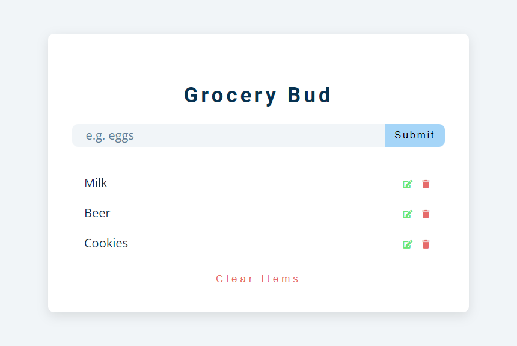

# Vanilla - Grocery List [TODO localstorage CRUD list]

## ✍🏻 Description
Create a dynamic TODO list with access to local storage. The purpose of this small project is to discover the principles of vanilla javascript:
* DOM access and controlling.
* Insert html code (dynamic content).
* Work with the local storage.

You can create, edit and delete items inside of your grocery list.
## Enjoy and share! 🤗

## 🚀 Getting Started
Only you need download the project and open index.html with a local server. That's it.

## 🎨 Preview

## 👩🏻‍💻 Technologies
1. HTML
2. CSS
3. Javascript
4. Browser local storage

### @Credits
Created by [@John Smilga](https://github.com/john-smilga/javascript-basic-projects/tree/master/14-grocery-bud)
▶️💻​ [Tutorial video](https://www.youtube.com/watch?v=3PHXvlpOkf4)